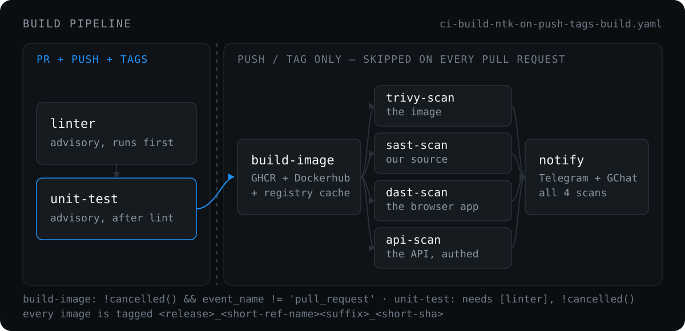
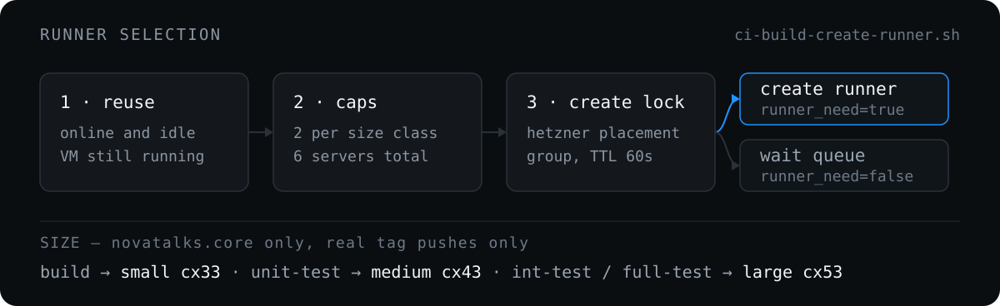

<p align="center">
  
</p>

`nova.ci` holds the GitHub Actions workflows that every NovaTalks product repository shares. A product repo keeps one thin caller workflow; everything else — lint, unit tests, image build, vulnerability scan, test suites, notifications and self-hosted runner provisioning — lives here and is called from `main`.

## Quick start

**1. Add the caller workflow** to the product repository as `.github/workflows/ci-build-trigger.yaml`. Three jobs: find a self-hosted runner, create one if none is free, then hand the original event to the switcher.

```yaml
  ci-build-trigger-switcher:
    name: CI Build Trigger Switcher
    uses: novaitdevteam/nova.ci/.github/workflows/ci-build-trigger-switcher.yaml@main
    secrets: inherit
    if: always()
    needs: [find-runner, create-runner]
    with:
      runner_labels: ${{ needs.find-runner.outputs.runner_labels }}
```

<details>
<summary>Full caller workflow</summary>

```yaml
name: CI Build Trigger
on:
  workflow_dispatch:
  push:
  pull_request:
  pull_request_target:
  pull_request_review:
  pull_request_review_comment:

jobs:
  find-runner:
    name: Check available runners
    env:
      GH_TOKEN: ${{ secrets.PERSONAL_ACCESS_TOKEN }}
      ORG: ${{ github.repository_owner }}
      HCLOUD_TOKEN: ${{ secrets.HCLOUD_TOKEN }}
    runs-on: ubuntu-latest
    outputs:
      runner_name: ${{ steps.check.outputs.runner_name }}
      runner_labels: ${{ steps.check.outputs.runner_labels }}
      runner_size: ${{ steps.check.outputs.runner_size }}
      runner_need: ${{ steps.check.outputs.runner_need }}
    steps:
      - name: Install script
        run: curl -O https://raw.githubusercontent.com/novaitdevteam/nova.ci/refs/heads/main/.github/workflows/ci-build-create-runner.sh
      - name: Check runners
        id: check
        run: |
          chmod +x ci-build-create-runner.sh
          ./ci-build-create-runner.sh

  create-runner:
    name: Create Hetzner Cloud runner
    if: ${{ needs.find-runner.outputs.runner_need == 'true' }}
    runs-on: ubuntu-latest
    needs: [find-runner]
    steps:
      - uses: novaitdevteam/nova.ci.hcloud-github-runner@main
        with:
          mode: create
          github_token: ${{ secrets.PERSONAL_ACCESS_TOKEN }}
          hcloud_token: ${{ secrets.HCLOUD_TOKEN }}
          server_type: ${{ needs.find-runner.outputs.runner_size }}
          image: 370307291
          location: fsn1
          runner_version: skip
          org: novaitdevteam
          name: ${{ needs.find-runner.outputs.runner_name }}
          labels: ${{ needs.find-runner.outputs.runner_labels }}

  ci-build-trigger-switcher:
    name: CI Build Trigger Switcher
    uses: novaitdevteam/nova.ci/.github/workflows/ci-build-trigger-switcher.yaml@main
    secrets: inherit
    if: always()
    needs: [find-runner, create-runner]
    with:
      runner_labels: ${{ needs.find-runner.outputs.runner_labels }}
```

</details>

Runner selection lives in [`ci-build-create-runner.sh`](.github/workflows/ci-build-create-runner.sh), downloaded from `main` — see [Runners](#runners).

**2. Trigger something:**

| I want to… | Do this |
| --- | --- |
| Build and publish an image | `git tag build-NC2-1234 && git push origin build-NC2-1234` |
| Build **and** scan the image for CVEs | `git tag scan-NC2-1234 && git push origin scan-NC2-1234` |
| Run unit tests only | `git tag unit-test-NC2-1234 && git push …` |
| Run integration tests only | `git tag int-test-NC2-1234 && git push …` |
| Run both suites | `git tag full-test-NC2-1234 && git push …` |
| Lint + unit tests on a change | Open a non-draft pull request |

Trigger tags are consumed: the workflow deletes them after the run. Test tags (`unit-test`, `int-test`, `full-test`) are routed for `novatalks.core` only.

**3. Keep routing centralized.** Build dispatch belongs in [`ci-build-trigger-switcher.yaml`](.github/workflows/ci-build-trigger-switcher.yaml), not in the local caller. The caller may receive PR-related events the switcher does not route; only matched switcher jobs do shared CI work.

## How a trigger is routed

[`ci-build-trigger-switcher.yaml`](.github/workflows/ci-build-trigger-switcher.yaml) receives the original repository event context and routes on repository name, event name and action, ref type, ref name, and commit message.

| Event | Repositories | Condition | Called workflow |
| --- | --- | --- | --- |
| `push` | standard build repositories | tag ref contains `build`, or starts with `scan` | [`…-tags-build.yaml`](.github/workflows/ci-build-ntk-on-push-tags-build.yaml) |
| `pull_request` | `novatalks.core` | non-draft PR on `opened`, `synchronize`, `reopened`, `ready_for_review` | [`…-tags-build.yaml`](.github/workflows/ci-build-ntk-on-push-tags-build.yaml) with a `build-engine` + `build-reporting` matrix |
| `pull_request` | standard PR build repositories | non-draft PR on the same actions | [`…-tags-build.yaml`](.github/workflows/ci-build-ntk-on-push-tags-build.yaml) with `build_target: build` |
| `push` | `novatalks.core` | tag contains `int-test` | [`…-run-test.yaml`](.github/workflows/ci-build-ntk-on-push-tags-run-test.yaml) with `test_mode: integration` |
| `push` | `novatalks.core` | tag contains `unit-test` | [`…-run-test.yaml`](.github/workflows/ci-build-ntk-on-push-tags-run-test.yaml) with `test_mode: unit` |
| `push` | `novatalks.core` | tag contains `full-test` | [`…-run-test.yaml`](.github/workflows/ci-build-ntk-on-push-tags-run-test.yaml) with `test_mode: both` |
| `push` | `nova.docs` | tag contains `build` | [`…-gh-deploy.yaml`](.github/workflows/ci-build-ntk-on-push-tags-gh-deploy.yaml) |
| `push` | `novatalks.ui-lite` | tag contains `build-apk` | [`…-mob-apk-build.yaml`](.github/workflows/ci-build-ntk-on-push-tags-mob-apk-build.yaml) |
| `push` | `novatalks.mobile` | tag contains `build-apk` | [`…-mob-apk-build-public.yaml`](.github/workflows/ci-build-ntk-on-push-tags-mob-apk-build-public.yaml) |
| `push` | `novatalks.ui-lite` | tag contains `build-pwa`, `build-spa`, or `build-crm` | [`…-mob-pwa-build.yaml`](.github/workflows/ci-build-ntk-on-push-tags-mob-pwa-build.yaml) |
| `push` | `novatalks.chatwidget` | tag contains `build` | [`…-widget-build.yaml`](.github/workflows/ci-build-ntk-on-push-tags-widget-build.yaml) |
| `push` | `novatalks.botflow.flows` | tag contains `build` | [`…-flows-to-pub.yaml`](.github/workflows/ci-build-ntk-on-push-tags-flows-to-pub.yaml) |
| `push` | `novatalks.tests` | any tag | [`ci-e2e-tests-manual.yaml`](.github/workflows/ci-e2e-tests-manual.yaml) |
| `push` | any repository | branch name contains `build-me-please` | [`…-on-push-branches.yaml`](.github/workflows/ci-build-ntk-on-push-branches.yaml) |
| ~~`push`~~ | ~~standard build repositories~~ | ~~branch push commit message contains `build`~~ | **Disabled 2026-08-12** — see [Legacy branch-push build route](#legacy-branch-push-build-route) |

**Standard build repositories:** `novatalks.core`, `novatalks.ui`, `nova.botflow`, `nova.chatsconnector.telegram-client-api`, `novatalks.dialer`, `nova.chatsconnector.genesys.cloud.premium.wizard.engine`, `novatalks.geoip-api`, `nova.chatsconnector.whatsapp-client-api`, `nova.chatsconnector.signal-client-api`, `novatalks.uspacy.connector`.

**Standard PR build repositories** are the same list without `novatalks.core`, which has its own PR targets.

### Legacy branch-push build route

The `call-external-on-pull-request-merged` job ("Call Builder On Merge PR") is **commented out in the switcher as of 2026-08-12**. It used to build and publish an image on any branch push whose head commit message contained `build`.

`contains(github.event.head_commit.message, 'build')` matches the substring anywhere in the full commit message, body included, so ordinary prose triggered full builds from feature branches:

- `Specs build partial module graphs with Test.createTestingModule` — [run 31576663619](https://github.com/novaitdevteam/novatalks.core/actions/runs/31576663619)
- `Verified: nest build, tsc --noEmit …` / `(3 build errors)` — [run 31607179275](https://github.com/novaitdevteam/novatalks.core/actions/runs/31607179275)

Both fired on plain feature-branch pushes and were easily mistaken for pull request builds. The job block is kept commented rather than deleted in case the route is needed again; if it returns, it should be gated on an explicit marker (for example `[build]`) and/or a branch allowlist, not a bare `build` substring.

Unaffected: tag pushes (`build*`, `scan*`), pull request routes, and the `build-me-please` branch route.

## Build pipeline

<p align="center">
  
</p>

[`ci-build-ntk-on-push-tags-build.yaml`](.github/workflows/ci-build-ntk-on-push-tags-build.yaml) accepts:

| Input | Default | Meaning |
| --- | --- | --- |
| `runner_labels` | — | runner label override |
| `build_target` | — | synthetic build selector, used mainly by PR dispatch |
| `trivy_severity` | `CRITICAL,HIGH` | severities counted by the scan and its fail policy |
| `trivy_mode` | `warn-only` | `warn-only`, `fail-on-critical`, or `fail-on-high` |

When `build_target` is empty, behavior is resolved from `github.ref_name`. When it is set, it drives lint and Dockerfile selection.

**Gates.** `build-image` has `needs: [linter, unit-test]` and the condition `!cancelled() && github.event_name != 'pull_request' && needs.unit-test.result == 'success'`. Lint is advisory — the build still runs if lint fails. A unit test failure blocks the build.

### Pull request builds

Pull request events run **lint and unit tests only**. The switcher routes supported non-draft PR events into the build workflow, but `build-image`, `trivy-scan` and the notifier are gated on `github.event_name != 'pull_request'`. No image is built or published, no scan runs, no notification is sent, and no tags are created or deleted.

The switcher passes a synthetic `build_target` so lint targeting still resolves:

- `novatalks.core` lints two targets per PR: `build-engine` and `build-reporting`. Unit tests run once — on the `build-engine` leg, skipped on `build-reporting` to avoid duplicate runs.
- Other standard PR build repositories get `build_target: build`, so PR lint follows the same strategy as `build*` tags.

### Lint behavior

For `novatalks.core`, linting is targeted by build target:

- `build-engine` → `npx eslint apps/engine libs/common libs/database --ext .ts`
- `build-reporting` → `npx eslint apps/reporting libs/common libs/database --ext .ts`
- any other target → `npm run lint`

`novatalks.core` lint also uses `NODE_OPTIONS=--max-old-space-size=4096`. Other repository-specific lint strategies live inside the build workflow; repositories without one use the fallback eslint bootstrap path.

### Dockerfile selection

Based on `build_target` when present, otherwise `github.ref_name`:

| Target | Dockerfile | Image suffix |
| --- | --- | --- |
| `build-engine` | `docker/engine.Dockerfile` | `_engine` |
| `build-reporting` | `docker/reporting.Dockerfile` | `_reporting` |
| `build-restore-historical` | `docker/restore-historical.Dockerfile` | `_restore-historical` |
| `build-message-source-id` | `docker/message-source-id.Dockerfile` | `_migrate-message-source-id` |
| `build` / default | `docker/server.Dockerfile` | none |
| `build-pwa` / `build-spa` / `build-crm` (mobile workflow) | — | `_pwa` / `_spa` / `_crm` |

### Image tags

Images are pushed to Docker Hub and GHCR as:

```text
<release>_<short-ref-name><image-suffix>_<short-sha>
```

`short-ref-name` comes from `github.head_ref` for pull requests, `github.ref_name` for branch builds, and `github.event.base_ref` for tag builds. It is sanitized so characters invalid in Docker tags (such as `/`) become `-`.

The workflow deletes the source tag only for real tag-triggered builds where `build_target` is empty. PR builds never delete tags.

### Build cache

A GHCR registry cache is kept per image variant:

```text
ghcr.io/<owner>/<repo>:buildcache<image-suffix>
```

Cache import is always configured. Cache export is enabled only when the source branch is `master`, `development`, or `main`.

### Docker and Buildx

Docker build jobs call [`install-docker/action.yml`](.github/actions/install-docker/action.yml) before Docker login, Buildx setup, or image builds. It is idempotent: it exits early when the Docker CLI and daemon are already available, otherwise it installs Docker and starts the daemon.

[`…-mob-pwa-build.yaml`](.github/workflows/ci-build-ntk-on-push-tags-mob-pwa-build.yaml) uses a named Docker context `builder` for Buildx and creates it idempotently, so reused self-hosted runners where the context already exists do not fail:

```bash
docker context inspect builder >/dev/null 2>&1 || docker context create builder
```

### Mobile APK builds

Mobile APK workflows use Node.js `22.22.0` so current Quasar/Icongenie tooling satisfies its Node engine requirement:

- [`…-mob-apk-build.yaml`](.github/workflows/ci-build-ntk-on-push-tags-mob-apk-build.yaml): internal `novatalks.ui-lite` APK/AAB build
- [`…-mob-apk-build-public.yaml`](.github/workflows/ci-build-ntk-on-push-tags-mob-apk-build-public.yaml): public `novatalks.mobile` APK build from `novatalks.ui-lite`

Self-hosted runner images do not ship the full Android toolchain, so both workflows install `zip` and `unzip` before Gradle setup (`unzip` is required by `gradle/actions/setup-gradle`, `zip` packages release artifacts) and then:

- resolve the Android SDK from `ANDROID_SDK_ROOT` or `ANDROID_HOME`, falling back to common self-hosted runner locations, and export it back to both variables
- install `platform-tools`, `platforms;android-35` and `build-tools;35.0.0` with `sdkmanager`
- write `src-capacitor/android/local.properties` with `sdk.dir=<resolved-sdk-path>`
- locate `apksigner` under the resolved SDK and sign the APK/AAB with it

## Container scanning (Trivy)

After a successful `build-image`, the `trivy-scan` job scans the exact image that was just pushed to GHCR:

```text
ghcr.io/<owner>/<repo>:<release>_<short-ref-name><image-suffix>_<short-sha>
```

Like the rest of the pipeline, it never runs on `pull_request` events.

**When it runs.** The `Resolve scan policy` step enables the scan automatically when the build source branch (`SHORT_REF_NAME`) is `main`, `master`, or `development`, and on demand when the triggering tag ref **starts with** `scan` (`scan`, `scan-NC2-1234`, …). Otherwise the image is built and the scan is skipped with a logged reason. The tag name is only a trigger keyword — branch, repository and commit always come from push metadata (`base_ref`, `GITHUB_REPOSITORY`, `GITHUB_SHA`).

```bash
git checkout my-feature-branch
git tag scan-NC2-1234
git push origin scan-NC2-1234   # builds the image, then scans it
```

**What it does.**

- Installs Docker, then `docker pull`s the built image (`linux/amd64`).
- Scans with the pinned [`aquasecurity/trivy-action@v0.36.0`](https://github.com/aquasecurity/trivy-action), which installs Trivy and manages the vulnerability and Java DBs itself — no manual two-step DB download.
- Runs three `trivy image --scanners vuln` passes for the configured severities: OS packages (`TRIVY_PKG_TYPES=os`), libraries (`TRIVY_PKG_TYPES=library`), and a JSON pass used only for counting. The OS and library passes reuse the first install via `skip-setup-trivy: true`.
- Assembles one `.report` file (`trivy-<repo>-<ref><suffix>-<sha>.report`) with `=== OS Vulnerabilities ===` and `=== Node.js Vulnerabilities ===` sections, matching the manual scan script layout.
- Counts CRITICAL and HIGH findings into the job log and the job summary.

**DB cache.** The Trivy DBs are cached under `${{ github.workspace }}/.cache/trivy` with `actions/cache`, with the action's own cache disabled (`cache: false`). The key embeds a 5-hour bucket (`trivy-db-5h-<floor(epoch/18000)>`), so a fresh DB is fetched at least every ~5 hours while runs inside the same window reuse it.

**Policy.** `trivy_mode` controls what findings do to the run:

| Mode | Behavior |
| --- | --- |
| `warn-only` (default) | always succeeds; findings surface as `::warning::` and in the job summary |
| `fail-on-critical` | fails on ≥ 1 CRITICAL; HIGH still only warns |
| `fail-on-high` | fails on ≥ 1 CRITICAL **or** HIGH |

The image is built and pushed before the scan in every mode, so a failing scan marks the run red as a signal but does not unpublish the image.

**Where the report is.**

- **Release asset** — attached to a GitHub prerelease tagged `TRIVY.SCAN_<release>_<ref><suffix>_<sha>`, downloadable by stable URL:

  ```text
  https://github.com/<owner>/<repo>/releases/download/TRIVY.SCAN_<release>_<ref><suffix>_<sha>/trivy-<repo>-<ref><suffix>-<sha>.report
  ```

- **Artifact** — the same `.report`, run-scoped.
- **Job summary** — severity counts plus a direct link.
- **Job logs** — the `Assemble report` and `Publish scan summary and apply policy` steps.
- **Notifications** — see below.

## Tests

### Unit tests (build gate)

The `unit-test` job runs as a fast parallel gate alongside `linter`, on both PR and non-PR events. It is repo-aware via a "Resolve test plan" step: currently only `novatalks.core` runs unit tests (`npm run test:unit`, jest `--selectProjects unit`, parallel via jest workers). All other standard build repositories resolve to a no-op success, so they stay backward compatible. To enable a new repository, add a case in that step.

A no-op success is reported to the notifier as `⏭️ n/a (no unit tests configured)`, **not** `✅` — the "End Unit Step" step checks whether `unit_test_command` was resolved, so a repository that ran zero tests is never shown as having passing tests. The gate itself is unchanged: a no-op run still counts as `needs.unit-test.result == 'success'` and does not block `build-image`.

There is no `continue-on-error`.

### Test workflow modes

[`…-run-test.yaml`](.github/workflows/ci-build-ntk-on-push-tags-run-test.yaml) accepts `test_mode`:

| `test_mode` | What runs | Trigger tag substring |
| --- | --- | --- |
| `unit` | unit tests only, no DB or Redis services | `unit-test` |
| `integration` (default) | integration tests with postgres + redis:8 services | `int-test` |
| `both` | unit tests, then integration tests | `full-test` |

The three substrings do not collide. In `both` mode the suites run sequentially — `integration-tests` has `needs: [unit-tests]` with a `!cancelled()` condition, so integration still runs when `unit-tests` was skipped (`integration` mode) or failed (`both` mode; the suites report independently), and a `full-test` run needs only one runner.

The workflow also has a `workflow_dispatch` trigger with a `test_mode` choice input, for manual runs inside `nova.ci` without pushing a tag.

### Integration tests

Integration tests run `npm run test:integration` (which already includes `--runInBand --forceExit --silent --verbose`) against redis:8 services shared across all steps. There is no `continue-on-error`; failures fail the job (they used to be masked). npm dependencies are cached via setup-node `cache: npm`.

The Postgres service image is repository-aware:

- `novatalks.core` → official `postgres:17.9-trixie` (PG 17.9 on Debian trixie), matching the production major version
- all other repositories (e.g. `novatalks.ui`) → `postgres:16`

The `POSTGRES_*` env vars, `pg_isready` health check and `CREATE EXTENSION pgcrypto` step are identical everywhere.

File storage is repository-aware too. For `novatalks.core` only, a `Configure S3 (Cloudflare R2) file storage` step writes `FILE_DRIVER=s3` and the `AWS_S3_*` settings to `$GITHUB_ENV` before the run, from the repository secrets `R2_ENDPOINT`, `R2_ACCESS_KEY_ID`, `R2_SECRET_ACCESS_KEY`, `R2_BUCKET` (region `auto`, path-style on). The step is gated on `github.event.repository.name == 'novatalks.core'`, so other repositories keep their default `FILE_DRIVER`. Secrets reach the reusable workflow through the switcher's `secrets: inherit`.

**Sharding** (jest `--shard` + matrix) is intentionally not enabled. Integration tests share database state and run with `--runInBand`; each shard would need its own Postgres and Redis services plus `--shard=i/N`. Unit tests already parallelize via jest workers, and the integration bottleneck is DB I/O, not CPU.

### Reading failures

- **`unit-test` red** — the build is blocked and the PR check fails. Fix the test or the code before merging or triggering a build.
- **`integration-tests` red** — a real integration failure (no longer hidden). Investigate via the `integration-test-report` artifact on the run.
- **Lint red** — advisory. It does not block the build, but it is reported in the notifier message.

## Runners

<p align="center">
  
</p>

Connected repositories download and run [`ci-build-create-runner.sh`](.github/workflows/ci-build-create-runner.sh) from `main`. The script:

- fetches the full Hetzner server list with pagination (`per_page=50`), so cap counts are not truncated to the API's default first page of 25
- lists GitHub self-hosted runners named `dev-00-gh-runner-*` (paginated, `per_page=100`, so idle runners past the first page stay visible)
- **reuses** an online idle runner whose size priority is at least the required size **and** whose backing Hetzner VM is in `running` status — registrations whose VM is deleting or gone (ghosts) are skipped, since a job queued on them would never start
- enforces a global `MAX_TOTAL_RUNNERS` cap (env-overridable, default `6`) counting **all** `dev-00-gh-runner-*` Hetzner servers in any status, across all sizes; at the cap the run goes to the wait queue regardless of per-size counts
- otherwise counts per-size Hetzner servers (`starting`, `initializing`, `running` of the required `server_type`) straight from the Hetzner API, and creates up to two runners per size
- emits `runner_need`, `runner_labels`, `runner_size`, `runner_name`
- runs under `set -euo pipefail` and fails the step loudly (`::error::`) on any Hetzner/GitHub API or parse error, instead of deciding on empty counts
- annotates wait-queue decisions with `::notice::` (runners of that size exist and will free up) or `::warning::` (starvation risk: no active VM of that size exists), plus a job-summary diagnostic block with the cap counts

A random 0–9 second jitter runs before the lookups to spread out concurrent triggers.

### Create lock

The create decision (this script) and the actual VM creation (the caller's next step) are seconds apart, and a new VM only becomes visible to the per-size count once Hetzner lists it — so two concurrent triggers could both see room and both create. Before emitting `runner_need=true` the script takes a short-TTL lock:

- The lock is a **Hetzner placement group** named `runner-create-lock-<size>` in the same project the runner VMs live in. Placement group names are unique per project, so `POST /placement_groups` is atomic — a `uniqueness_error` means somebody else holds the lock. A placement group is free, pure metadata, and creating one triggers no account notifications.
- It uses the same `HCLOUD_TOKEN` every caller already passes to create VMs, so the lock is **org-wide** with **no extra credentials and no GitHub permissions**. (GitHub-side variants — a lock ref in a shared repo or the caller's own repo — all foundered on token scope: the org PAT has no relevant `contents: write`, and the built-in `GITHUB_TOKEN` would need per-caller wiring.)
- The group's `epoch` label carries the acquisition timestamp. A lock younger than `RUNNER_LOCK_TTL_SECONDS` (default `60`) sends the run to the wait queue with a `::notice::`; an older, far-future, or unreadable lock is treated as stale, deleted and re-acquired.
- Nobody releases it explicitly — it expires by TTL, by which time the winner's VM is visible to the per-size count, which takes over as the guard. The next trigger for that size clears the stale group.
- The machinery **fails open**: any API failure emits a `::warning::` and proceeds without the lock (degrading to the small pre-lock race window) rather than blocking runner creation.

### Sizing (`novatalks.core` only)

Different tag types have very different resource needs, so `novatalks.core` uses a differentiated matrix:

| Tag substring | `test_mode` | Size | Hetzner type | Why |
| --- | --- | --- | --- | --- |
| `build` | — | `small` | cx33 | lint + build only |
| `unit-test` | `unit` | `medium` | cx43 | CPU-bound, no DB services |
| `int-test` / `full-test` | `integration` / `both` | `large` | cx53 | needs postgres + redis + app |
| anything else | — | `small` | cx33 | default |

`unit-test` is matched before the generic `test` check, so unit-only runs get `medium` while `int-test` and `full-test` get `large`.

The matrix applies **only to real tag pushes** (`refs/tags/*`). Branch pushes and PR events always resolve to `small`, so a branch named `NC2-123-fix-test-timeout` never provisions a large VM for a plain build.

One tag push provisions one runner size for the whole run, so a `full-test` tag runs both suites on the `large` runner (acceptable — only unit-only runs get `medium`), sequentially, since `integration-tests` needs `unit-tests`.

Each size class has its own **max-2** cap, measured from Hetzner server state rather than GitHub registrations, so in-flight creations count and offline ghost registrations do not. `medium` and `large` are independent pools, so unit-test and integration-test runs never contend. All pools also share the global `MAX_TOTAL_RUNNERS` cap.

**All other repositories always use `small`, regardless of tag.**

## Notifications

Notifier jobs use [`action-cond/action.yml`](.github/actions/action-cond/action.yml) to select success or failure message text, then send to Telegram and Google Chat with `actions/github-script@v8` and Node.js `fetch`. They use no Docker-based actions and require no Docker.

The build message carries:

- `ESLinter Check Status:` — ✅ / ❌
- `Unit Tests Status:` — ✅ passed, ❌ failed, or `⏭️ n/a (no unit tests configured)` when the repository has no unit test plan, so a repo without tests is never reported as if its tests passed
- a **Trivy line** color-coded by worst severity — `🔴 CRITICAL found!`, `🟠 HIGH found`, `🟢 clean`, plus `❌ FAILED` under a fail mode or `⏭️ skipped` when no scan ran — with CRITICAL/HIGH counts and the report download link

The job summary shows a matching colored alert banner (`CAUTION` / `WARNING` / `NOTE`). Under the default `warn-only` mode the build stays green; the styling is the signal. The notifier waits for `trivy-scan` to finish before sending.

## Validation

One harness runs every check:

```bash
./scripts/validate.sh   # or: make validate
```

[`scripts/validate.sh`](scripts/validate.sh) runs a YAML parser over all `.github/workflows/*.yaml` and `.github/actions/*/action.yml`, `git diff --check` for whitespace, an `.agents` ↔ `.claude` skill mirror sync check, and `actionlint` when available — **advisory** by default, because the repo carries a pre-existing backlog of shellcheck-info and expression findings. Set `STRICT_ACTIONLINT=1` to enforce once that backlog is cleared.

[`ci-self-validate.yaml`](.github/workflows/ci-self-validate.yaml) runs the same harness (with `actionlint` installed) on every pull request and push to `main`.

After changing CI behavior, still verify by hand that this README, [`CLAUDE.md`](CLAUDE.md), [`AGENTS.md`](AGENTS.md) and [`.agents/skills/nova-ci/SKILL.md`](.agents/skills/nova-ci/SKILL.md) (with its `.claude/` mirror) describe the same routing.

## Reference

<details>
<summary><b>Reusable workflows</b> — 12 in <a href="./.github/workflows">.github/workflows</a></summary>

| Workflow | Purpose |
| --- | --- |
| [`ci-build-trigger-switcher.yaml`](.github/workflows/ci-build-trigger-switcher.yaml) | central dispatcher |
| [`ci-build-ntk-on-push-tags-build.yaml`](.github/workflows/ci-build-ntk-on-push-tags-build.yaml) | lint, unit gate, build, publish, scan, notify |
| [`ci-build-ntk-on-push-tags-run-test.yaml`](.github/workflows/ci-build-ntk-on-push-tags-run-test.yaml) | test runner for `int-test`, `unit-test`, `full-test` tags |
| [`ci-build-ntk-on-push-tags-run-e2e.yaml`](.github/workflows/ci-build-ntk-on-push-tags-run-e2e.yaml) | reusable E2E test flow |
| [`ci-e2e-tests-manual.yaml`](.github/workflows/ci-e2e-tests-manual.yaml) | Playwright E2E flow for tagged test runs |
| [`ci-build-ntk-on-push-branches.yaml`](.github/workflows/ci-build-ntk-on-push-branches.yaml) | placeholder flow for selected branch builds |
| [`ci-build-ntk-on-push-tags-gh-deploy.yaml`](.github/workflows/ci-build-ntk-on-push-tags-gh-deploy.yaml) | GitHub Pages deploy |
| [`ci-build-ntk-on-push-tags-widget-build.yaml`](.github/workflows/ci-build-ntk-on-push-tags-widget-build.yaml) | chat widget build |
| [`ci-build-ntk-on-push-tags-mob-apk-build.yaml`](.github/workflows/ci-build-ntk-on-push-tags-mob-apk-build.yaml) | internal mobile APK build |
| [`ci-build-ntk-on-push-tags-mob-apk-build-public.yaml`](.github/workflows/ci-build-ntk-on-push-tags-mob-apk-build-public.yaml) | public mobile APK build |
| [`ci-build-ntk-on-push-tags-mob-pwa-build.yaml`](.github/workflows/ci-build-ntk-on-push-tags-mob-pwa-build.yaml) | mobile PWA, SPA and CRM builds |
| [`ci-build-ntk-on-push-tags-flows-to-pub.yaml`](.github/workflows/ci-build-ntk-on-push-tags-flows-to-pub.yaml) | publish botflow assets |

Plus one non-reusable meta workflow: [`ci-self-validate.yaml`](.github/workflows/ci-self-validate.yaml), which validates this repository's own workflows, actions and agent docs.

</details>

<details>
<summary><b>Internal actions</b> — <a href="./.github/actions">.github/actions</a></summary>

- [`action-cond/action.yml`](.github/actions/action-cond/action.yml) — composite replacement for the deprecated `haya14busa/action-cond`. Preserves the original interface: inputs `cond`, `if_true`, `if_false`; output `value`. Notifier workflows use it to select success or failure text.
- [`install-docker/action.yml`](.github/actions/install-docker/action.yml) — ensures the Docker CLI and daemon are available before Docker-based actions or Buildx steps run on self-hosted runners.

</details>

<details>
<summary><b>Agent context</b> — files that keep Claude Code and Codex in sync with this README</summary>

- [`CLAUDE.md`](CLAUDE.md) — canonical agent guidance for Claude Code and Codex
- [`AGENTS.md`](AGENTS.md) — Codex-compatible entry point, delegates to `CLAUDE.md`
- [`.agents/skills/nova-ci/SKILL.md`](.agents/skills/nova-ci/SKILL.md) — portable Nova CI maintenance skill
- [`.claude/skills/nova-ci/SKILL.md`](.claude/skills/nova-ci/SKILL.md) — Claude Code mirror of the skill

Keep them synchronized with this README whenever CI behavior changes.

</details>
