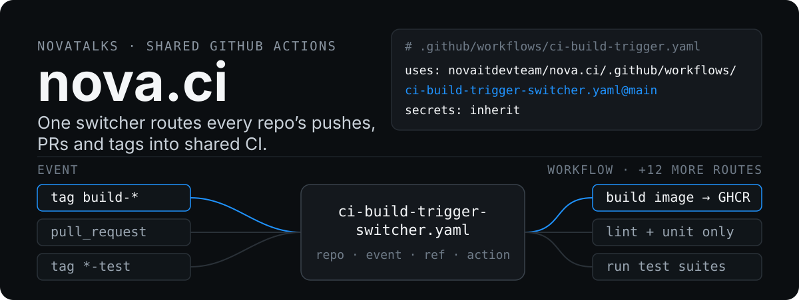

  

# nova.ci documentation

Shared GitHub Actions workflows for every NovaTalks product repository.
Start at [Quick start](getting-started/quick-start.md) if you are wiring a new repository into CI.

Pages are grouped by section; each section keeps its diagrams in its own `assets/` folder.

| Section | Page | What it answers |
| --- | --- | --- |
| [`getting-started/`](getting-started/) | [Quick start](getting-started/quick-start.md) | What do I add to my repository, and how do I trigger a build? |
| [`pipeline/`](pipeline/) | [How a trigger is routed](pipeline/routing.md) | Which workflow does my push, PR or tag actually call? |
| | [Build pipeline](pipeline/build-pipeline.md) | What runs, in what order, and what gates what? |
| | [Runners](pipeline/runners.md) | How a run gets a Hetzner runner: reuse, caps, create lock, sizing. |
| | [Notifications](pipeline/notifications.md) | What the Telegram and Google Chat messages carry. |
| [`testing/`](testing/) | [Unit and integration tests](testing/tests.md) | Unit vs integration, `test_mode`, and how failures are reported. |
| | [End-to-end tests](testing/e2e.md) | The Playwright suite from `novatalks.tests`: the lab and the ephemeral stack, the form, the report, why it flaked. · Outline (UA): [E2E-тести: лаба і ефемерний стенд](https://kb.novait.com.ua/doc/e2e-testi-laba-i-efemernij-stend-sho-zrobleno-i-yak-cim-koristuvatis-yNoTxVtLDC) |
| [`security/`](security/) | [Secret detection](security/secret-detection.md) | When Gitleaks runs, what to do when it fails, and how to allowlist a false positive. |
| | [Container scanning (Trivy)](security/container-scanning.md) | When the scan runs, what it produces, and how to fail on findings. |
| | [SAST and DAST](security/sast-dast.md) | What Semgrep, the ZAP baseline, the authenticated ZAP API scan, the dependency scan and the manual active pentest each cover, and why a failed boot is not a clean scan. |
| [`reference/`](reference/) | [Validation](reference/validation.md) | The one harness to run after any workflow change. |
| | [Reference](reference/reference.md) | Every reusable workflow, internal action and agent-context file. |
| [`superpowers/`](superpowers/) | plans and specs | Records of how larger changes were designed; not pages. |

---

[← Repository README](../README.md)
