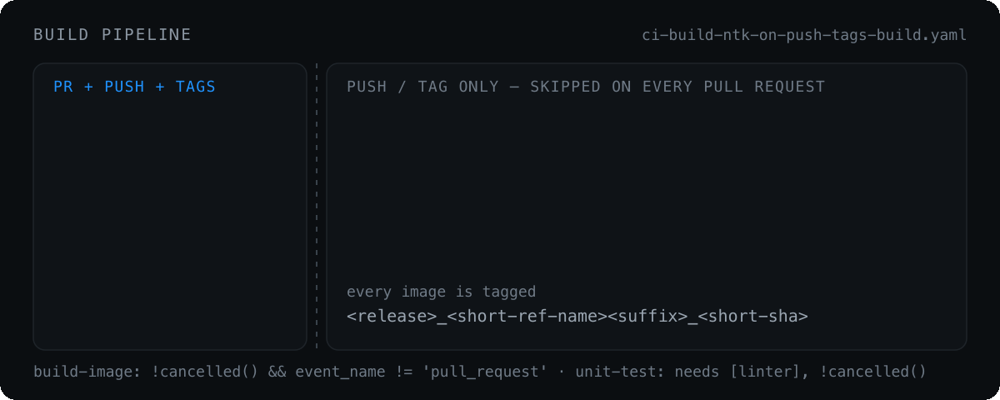

# Build pipeline

<p align="center">
  
</p>

[`ci-build-ntk-on-push-tags-build.yaml`](../.github/workflows/ci-build-ntk-on-push-tags-build.yaml) accepts:

| Input | Default | Meaning |
| --- | --- | --- |
| `runner_labels` | — | runner label override |
| `build_target` | — | synthetic build selector, used mainly by PR dispatch |
| `trivy_severity` | `CRITICAL,HIGH` | severities counted by the scan and its fail policy |
| `trivy_mode` | `warn-only` | `warn-only`, `fail-on-critical`, or `fail-on-high` |

When `build_target` is empty, behavior is resolved from `github.ref_name`. When it is set, it drives lint and Dockerfile selection.

**Gates.** `unit-test` has `needs: [linter]` with `if: !cancelled()`, so lint and unit tests run **sequentially** and a run occupies one runner at a time instead of two. `build-image` has `needs: [linter, unit-test]` and the condition `!cancelled() && github.event_name != 'pull_request'`. Both lint and unit tests are advisory — the build still runs if either fails. They are reported in the notifier and in the PR checks.

## Pull request builds

Pull request events run **lint and unit tests only**. The switcher routes supported PR events into the build workflow, but `build-image`, `trivy-scan` and the notifier are gated on `github.event_name != 'pull_request'`. No image is built or published, no scan runs, no notification is sent, and no tags are created or deleted.

**Drafts are linted too.** Skipping them used to look like a saving and was in fact a hole: `pull_request:` in the product callers carries no `types:`, so GitHub only ever sends `opened`, `synchronize` and `reopened` — never `ready_for_review`. A pull request opened as a draft and then marked ready got **no lint and no unit tests at all**, and reported `skipped` rather than red, so nobody noticed. [`novatalks.core#217`](https://github.com/novaitdevteam/novatalks.core/pull/217) sat open for a month that way.

Every head SHA arrives through `opened` or `synchronize`, so marking a pull request ready needs no event of its own — the check already sits on that SHA. The cost is that a push to a draft occupies a self-hosted runner for lint and unit; image builds are unaffected.

The switcher passes a synthetic `build_target` so lint targeting still resolves:

- `novatalks.core` lints two targets per PR: `build-engine` and `build-reporting`. Unit tests run once — on the `build-engine` leg, skipped on `build-reporting` to avoid duplicate runs.
- Other standard PR build repositories get `build_target: build`, so PR lint follows the same strategy as `build*` tags.

## Lint behavior

For `novatalks.core`, linting is targeted by build target:

- `build-engine` → `npx eslint apps/engine libs/common libs/database --ext .ts`
- `build-reporting` → `npx eslint apps/reporting libs/common libs/database --ext .ts`
- any other target → `npm run lint`

`novatalks.core` lint also uses `NODE_OPTIONS=--max-old-space-size=4096`. Other repository-specific lint strategies live inside the build workflow; repositories without one use the fallback eslint bootstrap path.

## Dockerfile selection

Based on `build_target` when present, otherwise `github.ref_name`:

| Target | Dockerfile | Image suffix |
| --- | --- | --- |
| `build-engine` | `docker/engine.Dockerfile` | `_engine` |
| `build-reporting` | `docker/reporting.Dockerfile` | `_reporting` |
| `build-restore-historical` | `docker/restore-historical.Dockerfile` | `_restore-historical` |
| `build-message-source-id` | `docker/message-source-id.Dockerfile` | `_migrate-message-source-id` |
| `build` / default | `docker/server.Dockerfile` | none |
| `build-pwa` / `build-spa` / `build-crm` (mobile workflow) | — | `_pwa` / `_spa` / `_crm` |

## Image tags

Images are pushed to Docker Hub and GHCR as:

```text
<release>_<short-ref-name><image-suffix>_<short-sha>
```

`short-ref-name` comes from `github.head_ref` for pull requests, `github.ref_name` for branch builds, and `github.event.base_ref` for tag builds. It is sanitized so characters invalid in Docker tags (such as `/`) become `-`.

The workflow deletes the source tag only for real tag-triggered builds where `build_target` is empty. PR builds never delete tags.

## Build cache

A GHCR registry cache is kept per image variant:

```text
ghcr.io/<owner>/<repo>:buildcache<image-suffix>
```

Cache import is always configured. Cache export is enabled only when the source branch is `master`, `development`, or `main`.

## Docker and Buildx

Docker build jobs call [`install-docker/action.yml`](../.github/actions/install-docker/action.yml) before Docker login, Buildx setup, or image builds. It is idempotent: it exits early when the Docker CLI and daemon are already available, otherwise it installs Docker and starts the daemon.

[`…-mob-pwa-build.yaml`](../.github/workflows/ci-build-ntk-on-push-tags-mob-pwa-build.yaml) uses a named Docker context `builder` for Buildx and creates it idempotently, so reused self-hosted runners where the context already exists do not fail:

```bash
docker context inspect builder >/dev/null 2>&1 || docker context create builder
```

## Mobile APK builds

Mobile APK workflows use Node.js `22.22.0` so current Quasar/Icongenie tooling satisfies its Node engine requirement:

- [`…-mob-apk-build.yaml`](../.github/workflows/ci-build-ntk-on-push-tags-mob-apk-build.yaml): internal `novatalks.ui-lite` APK/AAB build
- [`…-mob-apk-build-public.yaml`](../.github/workflows/ci-build-ntk-on-push-tags-mob-apk-build-public.yaml): public `novatalks.mobile` APK build from `novatalks.ui-lite`

Self-hosted runner images do not ship the full Android toolchain, so both workflows install `zip` and `unzip` before Gradle setup (`unzip` is required by `gradle/actions/setup-gradle`, `zip` packages release artifacts) and then:

- resolve the Android SDK from `ANDROID_SDK_ROOT` or `ANDROID_HOME`, falling back to common self-hosted runner locations, and export it back to both variables
- install `platform-tools`, `platforms;android-35` and `build-tools;35.0.0` with `sdkmanager`
- write `src-capacitor/android/local.properties` with `sdk.dir=<resolved-sdk-path>`
- locate `apksigner` under the resolved SDK and sign the APK/AAB with it

---

[← How a trigger is routed](routing.md) · [Docs index](README.md) · [Container scanning (Trivy) →](container-scanning.md)
