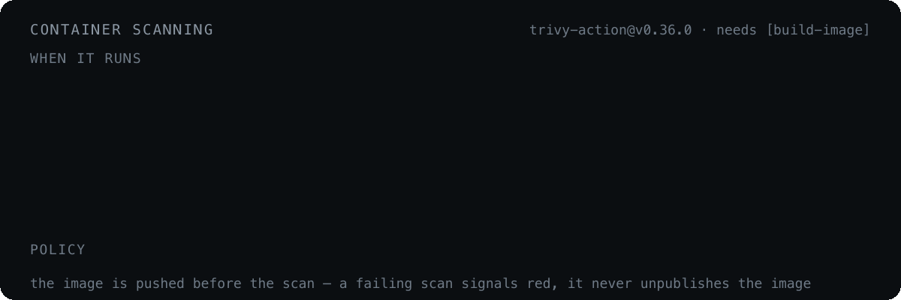

# Container scanning (Trivy)

<p align="center">
  
</p>

After a successful `build-image`, the `trivy-scan` job scans the exact image that was just pushed to GHCR:

```text
ghcr.io/<owner>/<repo>:<release>_<short-ref-name><image-suffix>_<short-sha>
```

Like the rest of the pipeline, it never runs on `pull_request` events.

**When it runs.** The `Resolve scan policy` step enables the scan automatically when the build source branch (`SHORT_REF_NAME`) is `main`, `master`, or `development`, and on demand when the triggering tag ref **starts with** `scan` (`scan`, `scan-NC2-1234`, …). Otherwise the image is built and the scan is skipped with a logged reason. The tag name is only a trigger keyword — branch, repository and commit always come from push metadata (`base_ref`, `GITHUB_REPOSITORY`, `GITHUB_SHA`).

```bash
git checkout my-feature-branch
git tag scan-NC2-1234
git push origin scan-NC2-1234   # builds the image, then scans it
```

**What it does.**

- Installs Docker, then `docker pull`s the built image (`linux/amd64`).
- Scans with the pinned [`aquasecurity/trivy-action@v0.36.0`](https://github.com/aquasecurity/trivy-action), which installs Trivy and manages the vulnerability and Java DBs itself — no manual two-step DB download.
- Runs three `trivy image --scanners vuln` passes for the configured severities: OS packages (`TRIVY_PKG_TYPES=os`), libraries (`TRIVY_PKG_TYPES=library`), and a JSON pass used only for counting. The OS and library passes reuse the first install via `skip-setup-trivy: true`.
- Assembles one `.report` file (`trivy-<repo>-<ref><suffix>-<sha>.report`) with `=== OS Vulnerabilities ===` and `=== Node.js Vulnerabilities ===` sections, matching the manual scan script layout.
- Counts CRITICAL and HIGH findings into the job log and the job summary.

**DB cache.** The Trivy DBs are cached under `${{ github.workspace }}/.cache/trivy` with `actions/cache`, with the action's own cache disabled (`cache: false`). The key embeds a 5-hour bucket (`trivy-db-5h-<floor(epoch/18000)>`), so a fresh DB is fetched at least every ~5 hours while runs inside the same window reuse it.

**Policy.** `trivy_mode` controls what findings do to the run:

| Mode | Behavior |
| --- | --- |
| `warn-only` (default) | always succeeds; findings surface as `::warning::` and in the job summary |
| `fail-on-critical` | fails on ≥ 1 CRITICAL; HIGH still only warns |
| `fail-on-high` | fails on ≥ 1 CRITICAL **or** HIGH |

The image is built and pushed before the scan in every mode, so a failing scan marks the run red as a signal but does not unpublish the image.

**Where the report is.**

- **Release asset** — attached to a GitHub prerelease tagged `TRIVY.SCAN_<release>_<ref><suffix>_<sha>`, downloadable by stable URL:

  ```text
  https://github.com/<owner>/<repo>/releases/download/TRIVY.SCAN_<release>_<ref><suffix>_<sha>/trivy-<repo>-<ref><suffix>-<sha>.report
  ```

- **Artifact** — the same `.report`, run-scoped.
- **Job summary** — severity counts plus a direct link.
- **Job logs** — the `Assemble report` and `Publish scan summary and apply policy` steps.
- **Notifications** — see below.

---

[← Build pipeline](build-pipeline.md) · [Docs index](README.md) · [Tests →](tests.md)
