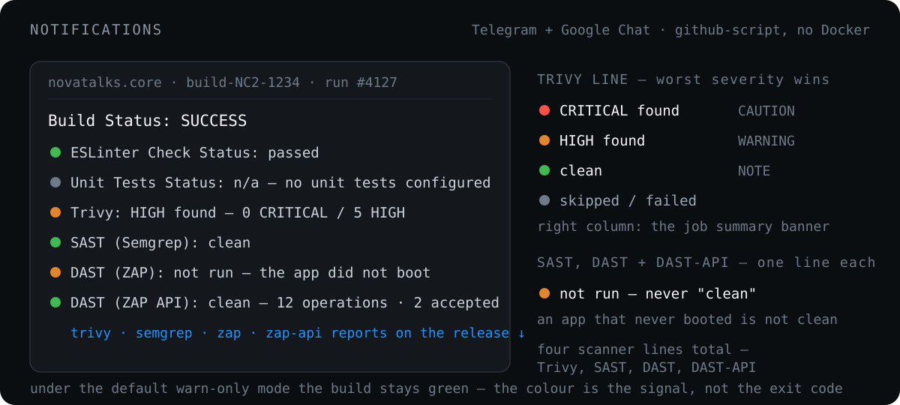

# Notifications

  

Notifier jobs use [`action-cond/action.yml`](../.github/actions/action-cond/action.yml) to select success or failure message text, then hand that text to [`notify/action.yml`](../.github/actions/notify/action.yml), which sends it to Telegram and Google Chat with `actions/github-script@v8` and Node.js `fetch`. Each channel is skipped when its credentials are empty, so a workflow that notifies one channel simply omits the other's inputs. Both sends check the response and fail the job when the API rejects the message. No Docker-based actions, and no Docker.

The build message carries:

- `ESLinter Check Status:` — ✅ / ❌
- `Unit Tests Status:` — ✅ passed, ❌ failed, or `⏭️ n/a (no unit tests configured)` when the repository has no unit test plan, so a repo without tests is never reported as if its tests passed
- a **Trivy line** color-coded by worst severity — `🔴 CRITICAL found!`, `🟠 HIGH found`, `🟢 clean`, plus `❌ FAILED` under a fail mode or `⏭️ skipped` when no scan ran — with CRITICAL/HIGH counts and the report download link

The job summary shows a matching colored alert banner (`CAUTION` / `WARNING` / `NOTE`). Under the default `warn-only` mode the build stays green; the styling is the signal. The notifier waits for `trivy-scan` to finish before sending.

---

[← Runners](runners.md) · [Docs index](README.md) · [Validation →](validation.md)
