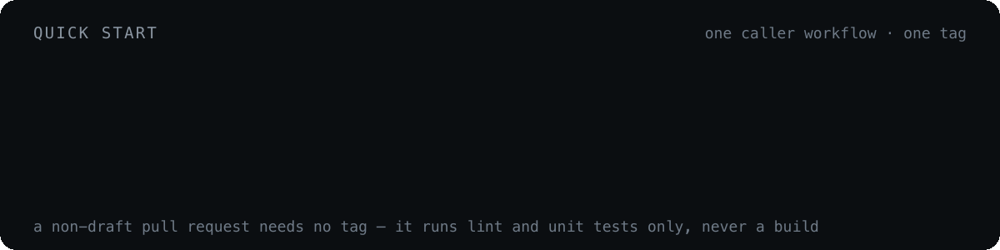

# Quick start

<p align="center">
  
</p>

**1. Add the caller workflow** to the product repository as `.github/workflows/ci-build-trigger.yaml`. Three jobs: find a self-hosted runner, create one if none is free, then hand the original event to the switcher.

```yaml
  ci-build-trigger-switcher:
    name: CI Build Trigger Switcher
    uses: novaitdevteam/nova.ci/.github/workflows/ci-build-trigger-switcher.yaml@main
    secrets: inherit
    if: always()
    needs: [find-runner, create-runner]
    with:
      runner_labels: ${{ needs.find-runner.outputs.runner_labels }}
```

<details>
<summary>Full caller workflow</summary>

```yaml
name: CI Build Trigger
on:
  workflow_dispatch:
  push:
  pull_request:
  pull_request_target:
  pull_request_review:
  pull_request_review_comment:

jobs:
  find-runner:
    name: Check available runners
    env:
      GH_TOKEN: ${{ secrets.PERSONAL_ACCESS_TOKEN }}
      ORG: ${{ github.repository_owner }}
      HCLOUD_TOKEN: ${{ secrets.HCLOUD_TOKEN }}
    runs-on: ubuntu-latest
    outputs:
      runner_name: ${{ steps.check.outputs.runner_name }}
      runner_labels: ${{ steps.check.outputs.runner_labels }}
      runner_size: ${{ steps.check.outputs.runner_size }}
      runner_need: ${{ steps.check.outputs.runner_need }}
    steps:
      - name: Install script
        run: curl -O https://raw.githubusercontent.com/novaitdevteam/nova.ci/refs/heads/main/.github/workflows/ci-build-create-runner.sh
      - name: Check runners
        id: check
        run: |
          chmod +x ci-build-create-runner.sh
          ./ci-build-create-runner.sh

  create-runner:
    name: Create Hetzner Cloud runner
    if: ${{ needs.find-runner.outputs.runner_need == 'true' }}
    runs-on: ubuntu-latest
    needs: [find-runner]
    steps:
      - uses: novaitdevteam/nova.ci.hcloud-github-runner@main
        with:
          mode: create
          github_token: ${{ secrets.PERSONAL_ACCESS_TOKEN }}
          hcloud_token: ${{ secrets.HCLOUD_TOKEN }}
          server_type: ${{ needs.find-runner.outputs.runner_size }}
          image: 370307291
          location: fsn1
          runner_version: skip
          org: novaitdevteam
          name: ${{ needs.find-runner.outputs.runner_name }}
          labels: ${{ needs.find-runner.outputs.runner_labels }}

  ci-build-trigger-switcher:
    name: CI Build Trigger Switcher
    uses: novaitdevteam/nova.ci/.github/workflows/ci-build-trigger-switcher.yaml@main
    secrets: inherit
    if: always()
    needs: [find-runner, create-runner]
    with:
      runner_labels: ${{ needs.find-runner.outputs.runner_labels }}
```

</details>

Runner selection lives in [`ci-build-create-runner.sh`](../.github/workflows/ci-build-create-runner.sh), downloaded from `main` — see [Runners](runners.md).

**2. Trigger something:**

| I want to… | Do this |
| --- | --- |
| Build and publish an image | `git tag build-NC2-1234 && git push origin build-NC2-1234` |
| Build **and** scan the image for CVEs | `git tag scan-NC2-1234 && git push origin scan-NC2-1234` |
| Run unit tests only | `git tag unit-test-NC2-1234 && git push …` |
| Run integration tests only | `git tag int-test-NC2-1234 && git push …` |
| Run both suites | `git tag full-test-NC2-1234 && git push …` |
| Lint + unit tests on a change | Open a non-draft pull request |

Trigger tags are consumed: the workflow deletes them after the run. Test tags (`unit-test`, `int-test`, `full-test`) are routed for `novatalks.core` only.

**3. Keep routing centralized.** Build dispatch belongs in [`ci-build-trigger-switcher.yaml`](../.github/workflows/ci-build-trigger-switcher.yaml), not in the local caller. The caller may receive PR-related events the switcher does not route; only matched switcher jobs do shared CI work.

---

[← Docs index](README.md) · [How a trigger is routed →](routing.md)
