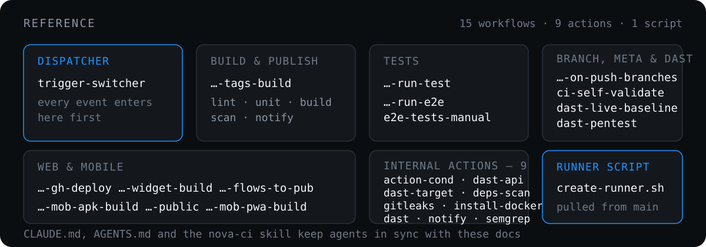

# Reference

  

<b>Reusable workflows</b> — 12 in <a href="../.github/workflows">.github/workflows</a>

| Workflow | Purpose |
| --- | --- |
| [`ci-build-trigger-switcher.yaml`](../.github/workflows/ci-build-trigger-switcher.yaml) | central dispatcher, plus the inline `secret-scan` and `secret-scan-notify` jobs |
| [`ci-build-ntk-on-push-tags-build.yaml`](../.github/workflows/ci-build-ntk-on-push-tags-build.yaml) | lint, unit gate, build, publish, scan, notify |
| [`ci-build-ntk-on-push-tags-run-test.yaml`](../.github/workflows/ci-build-ntk-on-push-tags-run-test.yaml) | test runner for `int-test`, `unit-test`, `full-test` tags |
| [`ci-build-ntk-on-push-tags-run-e2e.yaml`](../.github/workflows/ci-build-ntk-on-push-tags-run-e2e.yaml) | reusable E2E test flow |
| [`ci-e2e-tests-manual.yaml`](../.github/workflows/ci-e2e-tests-manual.yaml) | Playwright E2E flow for tagged test runs |
| [`ci-build-ntk-on-push-branches.yaml`](../.github/workflows/ci-build-ntk-on-push-branches.yaml) | placeholder flow for selected branch builds |
| [`ci-build-ntk-on-push-tags-gh-deploy.yaml`](../.github/workflows/ci-build-ntk-on-push-tags-gh-deploy.yaml) | GitHub Pages deploy |
| [`ci-build-ntk-on-push-tags-widget-build.yaml`](../.github/workflows/ci-build-ntk-on-push-tags-widget-build.yaml) | chat widget build |
| [`ci-build-ntk-on-push-tags-mob-apk-build.yaml`](../.github/workflows/ci-build-ntk-on-push-tags-mob-apk-build.yaml) | internal mobile APK build |
| [`ci-build-ntk-on-push-tags-mob-apk-build-public.yaml`](../.github/workflows/ci-build-ntk-on-push-tags-mob-apk-build-public.yaml) | public mobile APK build |
| [`ci-build-ntk-on-push-tags-mob-pwa-build.yaml`](../.github/workflows/ci-build-ntk-on-push-tags-mob-pwa-build.yaml) | mobile PWA, SPA and CRM builds |
| [`ci-build-ntk-on-push-tags-flows-to-pub.yaml`](../.github/workflows/ci-build-ntk-on-push-tags-flows-to-pub.yaml) | publish botflow assets |

Plus one non-reusable meta workflow: [`ci-self-validate.yaml`](../.github/workflows/ci-self-validate.yaml), which validates this repository's own workflows, actions and agent docs, and runs `secret-scan` over nova.ci itself.

The `secret-scan` job lives inline in the switcher rather than in its own file, so the required-status-check name stays two segments — see [Secret detection](secret-detection.md).

<b>Internal actions</b> — <a href="../.github/actions">.github/actions</a>

- [`action-cond/action.yml`](../.github/actions/action-cond/action.yml) — composite replacement for the deprecated `haya14busa/action-cond`. Preserves the original interface: inputs `cond`, `if_true`, `if_false`; output `value`. Notifier workflows use it to select success or failure text.
- [`install-docker/action.yml`](../.github/actions/install-docker/action.yml) — ensures the Docker CLI and daemon are available before Docker-based actions or Buildx steps run on self-hosted runners.
- [`gitleaks/action.yml`](../.github/actions/gitleaks/action.yml) — installs a version- and checksum-pinned Gitleaks and runs [`scan.sh`](../.github/actions/gitleaks/scan.sh) over the commits a pull request or push adds, with the central config from [`security/gitleaks/gitleaks.toml`](../security/gitleaks/gitleaks.toml). The only place any workflow may invoke Gitleaks; `validate.sh` fails on a direct call.
- [`notify/action.yml`](../.github/actions/notify/action.yml) — sends a composed notification to Telegram and Google Chat. Optional per channel; secrets and message text cross into the script through step `env:`, never through expression interpolation.

<b>Scripts</b> — <a href="../scripts">scripts</a>

- [`validate.sh`](../scripts/validate.sh) — the one harness to run after any change; see [Validation](validation.md)
- [`test-create-runner.sh`](../scripts/test-create-runner.sh) — offline scenario self-check for the runner script
- [`test-secret-scan.sh`](../scripts/test-secret-scan.sh) — offline scenario self-check for the secret scan, against real git fixtures and the pinned Gitleaks binary
- [`gitleaks-baseline.sh`](../scripts/gitleaks-baseline.sh) — one-time full-history secret audit across the product repositories; deliberately not a CI job

<b>Agent context</b> — files that keep Claude Code and Codex in sync with these docs

- [`CLAUDE.md`](../CLAUDE.md) — canonical agent guidance for Claude Code and Codex
- [`AGENTS.md`](../AGENTS.md) — Codex-compatible entry point, delegates to `CLAUDE.md`
- [`.agents/skills/nova-ci/SKILL.md`](../.agents/skills/nova-ci/SKILL.md) — portable Nova CI maintenance skill
- [`.claude/skills/nova-ci/SKILL.md`](../.claude/skills/nova-ci/SKILL.md) — Claude Code mirror of the skill

Keep them synchronized with these docs whenever CI behavior changes.

---

[← Validation](validation.md) · [Docs index →](README.md)
