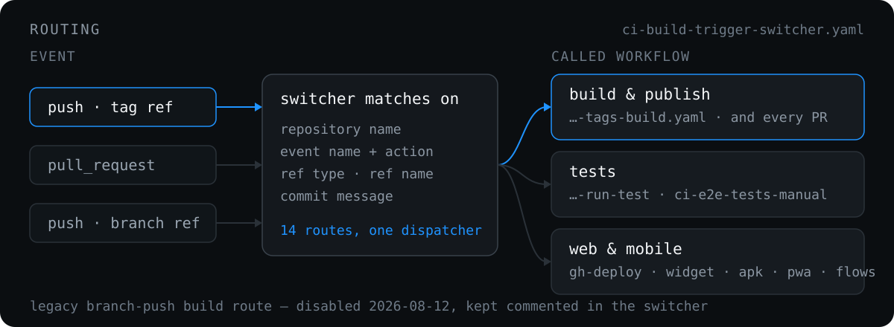

# How a trigger is routed

  

[`ci-build-trigger-switcher.yaml`](../.github/workflows/ci-build-trigger-switcher.yaml) receives the original repository event context and routes on repository name, event name and action, ref type, ref name, and commit message.

| Event | Repositories | Condition | Called workflow |
| --- | --- | --- | --- |
| `push` | standard build repositories | tag ref contains `build`, or starts with `scan` | [`…-tags-build.yaml`](../.github/workflows/ci-build-ntk-on-push-tags-build.yaml) |
| `pull_request` | `novatalks.core` | any PR, **drafts included**, on `opened`, `synchronize`, `reopened` | [`…-tags-build.yaml`](../.github/workflows/ci-build-ntk-on-push-tags-build.yaml) with a `build-engine` + `build-reporting` matrix |
| `pull_request` | standard PR build repositories | any PR, drafts included, on the same actions | [`…-tags-build.yaml`](../.github/workflows/ci-build-ntk-on-push-tags-build.yaml) with `build_target: build` |
| `push` | `novatalks.core` | tag contains `int-test` | [`…-run-test.yaml`](../.github/workflows/ci-build-ntk-on-push-tags-run-test.yaml) with `test_mode: integration` |
| `push` | `novatalks.core` | tag contains `unit-test` | [`…-run-test.yaml`](../.github/workflows/ci-build-ntk-on-push-tags-run-test.yaml) with `test_mode: unit` |
| `push` | `novatalks.core` | tag contains `full-test` | [`…-run-test.yaml`](../.github/workflows/ci-build-ntk-on-push-tags-run-test.yaml) with `test_mode: both` |
| `push` | `nova.docs` | tag contains `build` | [`…-gh-deploy.yaml`](../.github/workflows/ci-build-ntk-on-push-tags-gh-deploy.yaml) |
| `push` | `novatalks.ui-lite` | tag contains `build-apk` | [`…-mob-apk-build.yaml`](../.github/workflows/ci-build-ntk-on-push-tags-mob-apk-build.yaml) |
| `push` | `novatalks.mobile` | tag contains `build-apk` | [`…-mob-apk-build-public.yaml`](../.github/workflows/ci-build-ntk-on-push-tags-mob-apk-build-public.yaml) |
| `push` | `novatalks.ui-lite` | tag contains `build-pwa`, `build-spa`, or `build-crm` | [`…-mob-pwa-build.yaml`](../.github/workflows/ci-build-ntk-on-push-tags-mob-pwa-build.yaml) |
| `push` | `novatalks.chatwidget` | tag contains `build` | [`…-widget-build.yaml`](../.github/workflows/ci-build-ntk-on-push-tags-widget-build.yaml) |
| `push` | `novatalks.botflow.flows` | tag contains `build` | [`…-flows-to-pub.yaml`](../.github/workflows/ci-build-ntk-on-push-tags-flows-to-pub.yaml) |
| `push` | `novatalks.tests` | any tag | [`ci-e2e-tests-manual.yaml`](../.github/workflows/ci-e2e-tests-manual.yaml) |
| `pull_request` / `push` | the 11 secret-scan repositories | PRs, drafts included, on the same actions; branch push to the default branch or `main`/`master`/`development` | the inline `secret-scan` job — see [Secret detection](secret-detection.md) |
| `pull_request` | the same 11 repositories | PRs, drafts included, on the same actions | the inline `sast-scan` job — Semgrep on the proposed code, advisory; see [SAST and DAST](sast-dast.md#semgrep-on-the-pull-request) |
| `push` | any repository | branch name contains `build-me-please` | [`…-on-push-branches.yaml`](../.github/workflows/ci-build-ntk-on-push-branches.yaml) |
| ~~`push`~~ | ~~standard build repositories~~ | ~~branch push commit message contains `build`~~ | **Disabled 2026-08-12** — see [Legacy branch-push build route](#legacy-branch-push-build-route) |

**Standard build repositories:** `novatalks.core`, `novatalks.ui`, `nova.botflow`, `nova.chatsconnector.telegram-client-api`, `novatalks.dialer`, `nova.chatsconnector.genesys.cloud.premium.wizard.engine`, `novatalks.geoip-api`, `nova.chatsconnector.whatsapp-client-api`, `nova.chatsconnector.signal-client-api`, `novatalks.uspacy.connector`.

**Standard PR build repositories** are the same list without `novatalks.core`, which has its own PR targets.

## Legacy branch-push build route

The `call-external-on-pull-request-merged` job ("Call Builder On Merge PR") is **commented out in the switcher as of 2026-08-12**. It used to build and publish an image on any branch push whose head commit message contained `build`.

`contains(github.event.head_commit.message, 'build')` matches the substring anywhere in the full commit message, body included, so ordinary prose triggered full builds from feature branches:

- `Specs build partial module graphs with Test.createTestingModule` — [run 31576663619](https://github.com/novaitdevteam/novatalks.core/actions/runs/31576663619)
- `Verified: nest build, tsc --noEmit …` / `(3 build errors)` — [run 31607179275](https://github.com/novaitdevteam/novatalks.core/actions/runs/31607179275)

Both fired on plain feature-branch pushes and were easily mistaken for pull request builds. The job block is kept commented rather than deleted in case the route is needed again; if it returns, it should be gated on an explicit marker (for example `[build]`) and/or a branch allowlist, not a bare `build` substring.

Unaffected: tag pushes (`build*`, `scan*`), pull request routes, and the `build-me-please` branch route.

---

[← Quick start](quick-start.md) · [Docs index](README.md) · [Build pipeline →](build-pipeline.md)
