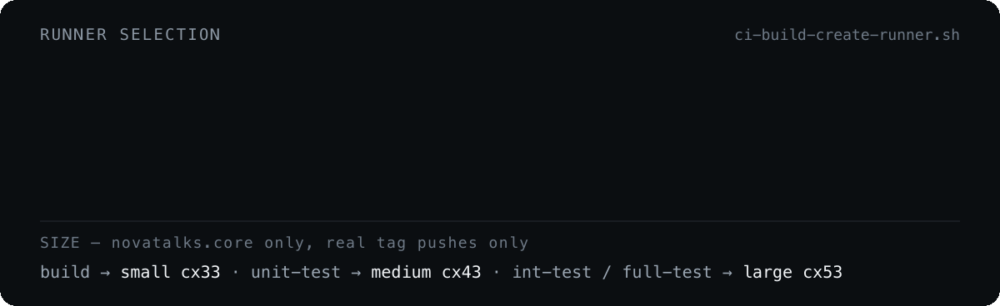

# Runners

  

Connected repositories download and run [`ci-build-create-runner.sh`](../.github/workflows/ci-build-create-runner.sh) from `main`. The script:

- fetches the full Hetzner server list with pagination (`per_page=50`), so cap counts are not truncated to the API's default first page of 25
- lists GitHub self-hosted runners named `dev-00-gh-runner-*` (paginated, `per_page=100`, so idle runners past the first page stay visible)
- **reuses** an online idle runner whose size priority is at least the required size **and** whose backing Hetzner VM is in `running` status — registrations whose VM is deleting or gone (ghosts) are skipped, since a job queued on them would never start
- enforces a global `MAX_TOTAL_RUNNERS` cap (env-overridable, default `8` — the sum of the per-size caps: 2 small + 4 medium + 2 large) counting **all** `dev-00-gh-runner-*` Hetzner servers in any status, across all sizes; at the cap the run goes to the wait queue regardless of per-size counts
- otherwise counts per-size Hetzner servers (`starting`, `initializing`, `running` of the required `server_type`) straight from the Hetzner API, and creates up to two runners per size
- emits `runner_need`, `runner_labels`, `runner_size`, `runner_name`
- runs under `set -euo pipefail` and fails the step loudly (`::error::`) on any Hetzner/GitHub API or parse error, instead of deciding on empty counts
- annotates wait-queue decisions with `::notice::` (runners of that size exist and will free up) or `::warning::` (starvation risk: no active VM of that size exists), plus a job-summary diagnostic block with the cap counts

A random 0–9 second jitter runs before the lookups to spread out concurrent triggers.

## Create lock

The create decision (this script) and the actual VM creation (the caller's next step) are seconds apart, and a new VM only becomes visible to the per-size count once Hetzner lists it — so two concurrent triggers could both see room and both create. Before emitting `runner_need=true` the script takes a short-TTL lock:

- The lock is a **Hetzner placement group** named `runner-create-lock-<size>` in the same project the runner VMs live in. Placement group names are unique per project, so `POST /placement_groups` is atomic — a `uniqueness_error` means somebody else holds the lock. A placement group is free, pure metadata, and creating one triggers no account notifications.
- It uses the same `HCLOUD_TOKEN` every caller already passes to create VMs, so the lock is **org-wide** with **no extra credentials and no GitHub permissions**. (GitHub-side variants — a lock ref in a shared repo or the caller's own repo — all foundered on token scope: the org PAT has no relevant `contents: write`, and the built-in `GITHUB_TOKEN` would need per-caller wiring.)
- The group's `epoch` label carries the acquisition timestamp. A lock younger than `RUNNER_LOCK_TTL_SECONDS` (default `60`) sends the run to the wait queue with a `::notice::`; an older, far-future, or unreadable lock is treated as stale, deleted and re-acquired.
- Nobody releases it explicitly — it expires by TTL, by which time the winner's VM is visible to the per-size count, which takes over as the guard. The next trigger for that size clears the stale group.
- The machinery **fails open**: any API failure emits a `::warning::` and proceeds without the lock (degrading to the small pre-lock race window) rather than blocking runner creation.

## Sizing (`novatalks.core` only)

Different tag types have very different resource needs, so `novatalks.core` uses a differentiated matrix:

| Tag substring | `base_ref` | `test_mode` | Size | Hetzner type | Why |
| --- | --- | --- | --- | --- | --- |
| `scan*` | any branch | — | `medium` | cx43 | runs [DAST](sast-dast.md): postgres + redis + app + ZAP |
| `build` | `main` / `master` / `development` | — | `medium` | cx43 | trunk builds run DAST |
| `build` | any other branch | — | `small` | cx33 | lint + build only |
| `unit-test` | — | `unit` | `medium` | cx43 | CPU-bound, no DB services |
| `int-test` / `full-test` | — | `integration` / `both` | `large` | cx53 | needs postgres + redis + app |
| anything else | — | — | `small` | cx33 | default |

`scan*` is matched first, and `unit-test` before the generic `test` check, so unit-only runs get `medium` while `int-test` and `full-test` get `large`.

**The `medium` branch for trunk builds exists for the DAST stack, not to make builds faster.** It mirrors the DAST gate exactly rather than approximating it: a `scan*` tag runs DAST on any branch and used to fall through to `small`, and a `build` tag only runs DAST when its `base_ref` is a trunk branch. `medium` is sized for the DAST stack — postgres, redis, the application and ZAP on one VM, the same load `int-test` already earns `large` for — so narrowing it back to feature-branch builds would leave trunk builds, the ones that actually run DAST, on `small`. Widening it to every `novatalks.core` build moves ordinary feature builds into the `medium` pool, where they start contending with unit-test runs.

A tag push carries no branch in `GITHUB_REF`, so `base_ref` is read from the event payload with `jq` inside the script — the same field `build-image` derives `SHORT_REF_NAME` from, so sizing and scanning agree by construction. It is not a new input, because that would mean editing every product-repository caller.

The matrix applies **only to real tag pushes** (`refs/tags/*`). Branch pushes and pull request events carry no sizing intent — `GITHUB_REF` is `refs/heads/<branch>` or `refs/pull/<n>/merge`, not `refs/tags/*` — so they always resolve to `small`, and a branch named `NC2-123-fix-test-timeout` never provisions a large VM. This is about the *ref that triggered the run*, not about the branch a tag points at: a `build` tag pushed on trunk is still a tag push, and still gets `medium`.

One tag push provisions one runner size for the whole run, so a `full-test` tag runs both suites on the `large` runner (acceptable — only unit-only runs get `medium`), sequentially, since `integration-tests` needs `unit-tests`.

Each size class has its own cap, measured from Hetzner server state rather than GitHub registrations, so in-flight creations count and offline ghost registrations do not. **`medium` is 4; `small` and `large` are 2** (`MAX_MEDIUM_RUNNERS` / `MAX_PER_SIZE` override either). `medium` is the scan pool: a `novatalks.core` trunk push builds two targets at once, and each fans out into `trivy-scan`, `sast-scan`, `dast-scan` and `api-scan` in parallel rather than in a chain — a fan-out is worth nothing without somewhere to fan out to. `small` and `large` have no such fan-out (one feature build; one long `int-test` job), so a third VM there would idle. `medium` and `large` are independent pools, so unit-test and integration-test runs never contend. Trunk and `scan*` builds do share the `medium` pool with unit-test runs — that is the cost of the DAST sizing branch, and the reason it is kept as narrow as it is. All pools also share the global `MAX_TOTAL_RUNNERS` cap.

**All other repositories always use `small`, regardless of tag** — with one exception, `novatalks.tests`, which has a pool of its own.

## The E2E pool

`novatalks.tests` resolves to `e2e-small` (cx33) or `e2e-medium` (cx43, when its form asks for `medium` or `large`), and its VMs are named `dev-00-gh-runner-e2e-*`. Counts, caps, the reuse filter and the create lock are all scoped to one pool, so the two never borrow from each other: a build cannot pick up an idle E2E runner, an E2E run cannot pick up a build one, a full build pool does not block a suite, and the E2E pool has its own cap, 4 since 2026-09-21.

**An E2E run takes a runner of its own while the pool is below that cap**, instead of
reusing an idle one. Reuse returns a *label*, not a reservation: two runs dispatched seconds
apart both see the same idle runner — neither job has started, so it is not busy yet — both
decide no VM is needed, and both queue on one machine. A suite sat queued for 50 minutes that
way on 2026-09-21 while there was room for three more VMs. The build pool still reuses, and
should: its jobs are minutes long, so waiting briefly for a warm runner beats a two-minute
boot, while a suite that guesses wrong waits for the length of another suite. At the cap
there is nothing to create, so an idle runner is exactly what to wait for. It was 2 while every run needed the stand and a third would only queue behind its shared account; an ephemeral run brings its own stack and shares nothing, so the cap was all that serialised them. Raising it takes nothing from product builds, because the pool counts and caps itself.

The reason is duration rather than size. The `@e2e` regression takes 1.2 h; sharing the build pool would park it on one of the two `small` runners for that long and queue every other repository's build behind it. The name still begins with `dev-00-gh-runner-`, so the leak watchdog and any project-wide total keep seeing these VMs.

The size input remains a measuring tool: four Playwright workers load a 4-core runner to 2.3, and the regression took the same 1.2 h on 4 and on 8 cores. An unknown value, or a push or pull request that carries no inputs, resolves to the small size, never up.

---

[← Secret detection](secret-detection.md) · [Docs index](README.md) · [Notifications →](notifications.md)
