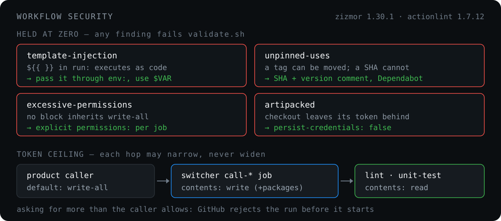

# Workflow security

  

The other pages under `security/` scan the product repositories' code. This one is about
the workflows themselves. Every product repository runs these files with its own token
and its own secrets, and this repository is public. A weakness here is in every
product repository at once.

All of it is enforced by [`scripts/validate.sh`](../../scripts/validate.sh), which
[`ci-self-validate.yaml`](../../.github/workflows/ci-self-validate.yaml) runs on every pull
request and every push to `main`. What each check prints and how to run it:
[Validation](../reference/validation.md).

## The four zizmor audits held at zero

[zizmor](https://docs.zizmor.sh/) 1.30.1, pinned by version and SHA-256 in
`ci-self-validate.yaml`, reports many kinds of finding. Four fail the run. Each
failure prints `file:line`, the audit name and the fix.

| Audit | What it catches | Why it fails the run |
| --- | --- | --- |
| `template-injection` | `${{ … }}` expanded into `run:` or a `github-script` | The expression is pasted into the script before bash or Node parses it. A branch name, a tag or a PR title then runs as code, with the job's token and secrets. Pass the value through step `env:` and read `$VAR` (`process.env.X` in JS). |
| `unpinned-uses` | a third-party action referenced by tag or branch | Whoever controls the action's repository can move a tag. A commit SHA cannot move. |
| `excessive-permissions` | a job with no `permissions:` block | That job gets the caller's default token, and the default in the product repositories is write on every scope (see [below](#the-token-ceiling)). |
| `artipacked` | an `actions/checkout` without `persist-credentials: false` | Checkout writes the token into `.git/config`. Every later step can read it from there, including `npm ci` install scripts that come from the pull request being tested. |

Two things this does not catch on its own:

- **`GITHUB_ENV` launders a value past the audit.** A ref name written to `GITHUB_ENV`
  and expanded later carries the same risk as the original, and zizmor sees only a
  plain variable. So `SHORT_REF_NAME` is sanitized where it is first computed, to
  `[A-Za-z0-9_.-]`. This happens in the build workflow and the mobile, widget and PWA
  workflows.
- **Plan commands are executed on purpose.** The lint and unit plan steps resolve a
  command from the product repository's own `package.json`, and the next step runs it
  as `eval "$PLAN_COMMAND"`. That is repository code by design. The `eval` makes the
  execution visible; it does not make it safe.

### What stays advisory

The rest of zizmor's output is printed as a `WARN` line and does not fail the run. On
2026-09-29 that was 14 `secrets-inherit`, 9 `superfluous-actions`, 6 `adhoc-packages`,
3 `self-repository`, 3 `cache-poisoning` and 2 `github-env`.

- `secrets-inherit` is by design. The switcher forwards the caller's secrets to the
  workflow it routes to, and it cannot know in advance which ones that workflow needs.
- `cache-poisoning` (the Trivy DB cache in the build workflow, and the toolchain caches
  in the two APK workflows) and `github-env` (the Gitleaks installer writing
  `GITHUB_PATH`) are **reported, not gated, and not triaged**. Nobody has yet decided
  whether they are real. Do not read their absence from the gate as a verdict.

zizmor runs with `--offline`. The audits that need the network are not run: whether a
pinned SHA is a known-vulnerable version, and whether it belongs to the action's own
repository or to a fork (`impostor-commit`). Dependabot proposes the SHAs, and that is the
only mitigation.

## The token ceiling

A reusable workflow cannot get more token permissions than the job that calls it
grants. If one of its jobs asks for more, GitHub rejects the **whole run before any job
starts**. So every `call-*` job in the switcher is a ceiling for the workflow it calls:

| Job | Permissions |
| --- | --- |
| lint and unit tests (they run pull request code) | `contents: read` |
| a switcher `call-*` job whose workflow pushes an image to GHCR | `contents: write`, `packages: write` |
| any other `call-*` job | `contents: write` (tag deletion, releases), or `contents: read` |
| `flows-to-pub` | `contents: write`, down from `write-all`; its API writes use `CI_GITHUB_PAT` |

`validate.sh`'s **Token permissions** check reads these statically, and fails on two
things:

1. **a job with no `permissions:` block.** zizmor's `excessive-permissions` does not
   look inside `workflow_call`-only files, which is almost every workflow here. Without
   this check, a reusable workflow's job would silently inherit its caller's whole
   ceiling.
2. **a called job that asks for more than its `call-*` caller allows.** This is exactly
   the startup rejection above. Without the check, the first sign of it is a red run in
   a product repository.

> [!WARNING]
> **The check stops at this repository.** The product callers run the switcher job with
> no `permissions:` block, so they pass their repository's default token. Today that
> default is permissive: `novatalks.dialer`'s run 36589653802 lists write on every scope
> in the bootstrap job's `GITHUB_TOKEN Permissions` block. The ceilings above are
> therefore narrower than the default, and nothing broke. If an organisation owner or a
> repository admin switches the default to read-only, every build that routes to a
> `contents: write` workflow is rejected at startup. The fix then belongs in the
> caller's switcher job, as an explicit `permissions:` block. Do not lower the ceilings
> here.

## Pins and Dependabot

All 97 third-party `uses:` lines are pinned by commit SHA, with the version as a comment
(`@<sha> # v7.0.1`). nova.ci's own actions and workflows stay on `@main`, and
[`.github/zizmor.yml`](../../.github/zizmor.yml) allows exactly that: every caller has to
see the same revision, and the [self-reference pins](../reference/validation.md#self-reference-pins)
check fails on anything else.

[`.github/dependabot.yml`](../../.github/dependabot.yml) moves the pins:

- **weekly**, covering the workflows and every composite action.
- **7-day cooldown.** A release gets a week to be withdrawn before it is proposed. A merge
  to `main` goes live in every caller at once, and there is no staging.
- **minor and patch grouped** into one PR a week. A **major** gets a PR of its own,
  because a major can change inputs or defaults.
- **`aquasecurity/*` always gets a PR of its own.** It is 0.x, so a minor release can
  break things, and for `trivy-action` it also moves the Trivy binary, its DB and its
  cache behaviour.

**Merge a major only after its workflow has run green.** On 2026-09-29 checkout 7,
upload-artifact 7, cache 6 and action-gh-release 3 were merged. All four run on Node 24,
which needs runner 2.327.1 or newer. Every runner here is on 2.337.0 or newer: the ARC
image is pinned there, Hetzner VMs install the latest agent at boot, and the legacy
controller was patched the same day. `android-actions/setup-android` 4 (#73) is **held
on purpose**. Its only callers are the two APK workflows. #68 and #69 rewrote both of them, and
neither has run since, so a red first run after a merge could not be pinned on the bump
or on the rewrite. It waits for one green `build-apk` on current `main`.

## actionlint

actionlint 1.7.12, pinned by SHA-256 like zizmor, has been **enforced** since
2026-09-29, when its backlog reached zero. `validate.sh` runs zizmor first on purpose:
actionlint has been seen to hang locally on the build workflow, and zizmor is the gate
that must not be skipped.

## Honest limits

- **Locally, a missing tool is a skip; in CI it is a failure.** A green local run with
  `skip: actionlint not installed` has not checked anything.
  `ci-self-validate` is the real gate.
- **shellcheck comes from the runner image, not from a pin.** `ci-self-validate` runs on
  GitHub-hosted `ubuntu-latest`, which is free for a public repository. That label
  moves to Ubuntu 26.04 from 2026-10-19. A newer shellcheck can then red an untouched
  tree. That red is a new finding, not a regression in the pull request.
- **Every check reads patterns.** A `${{ }}` split across a line-broken block scalar, or a
  permission granted through a path the Token permissions check does not model, gets
  through. The checks stop careless copy-paste, not a determined bypass. The same is
  true of the [scanner invocation guard](../reference/validation.md#scanner-invocation-guard).

---

[← SAST and DAST](sast-dast.md) · [Docs index](../README.md) · [Validation →](../reference/validation.md)
