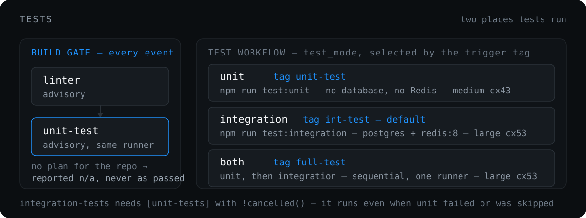

# Tests

  

## Unit tests (build gate)

The `unit-test` job runs right after `linter`, on the same runner, on both PR and non-PR events (sequential so a single build does not occupy two runners). It runs even when lint fails (`if: !cancelled()`), and its result is advisory — it does not block `build-image`. It is repo-aware via a "Resolve test plan" step: currently only `novatalks.core` runs unit tests (`npm run test:unit`, jest `--selectProjects unit`, parallel via jest workers). All other standard build repositories resolve to a no-op success, so they stay backward compatible. To enable a new repository, add a case in that step.

A no-op success is reported to the notifier as `⏭️ n/a (no unit tests configured)`, **not** `✅` — the "End Unit Step" step checks whether `unit_test_command` was resolved, so a repository that ran zero tests is never shown as having passing tests. A no-op run still reports `success` as the job result.

There is no `continue-on-error`.

## Test workflow modes

[`…-run-test.yaml`](../.github/workflows/ci-build-ntk-on-push-tags-run-test.yaml) accepts `test_mode`:

| `test_mode` | What runs | Trigger tag substring |
| --- | --- | --- |
| `unit` | unit tests only, no DB or Redis services | `unit-test` |
| `integration` (default) | integration tests with postgres + redis:8 services | `int-test` |
| `both` | unit tests, then integration tests | `full-test` |

The three substrings do not collide. In `both` mode the suites run sequentially — `integration-tests` has `needs: [unit-tests]` with a `!cancelled()` condition, so integration still runs when `unit-tests` was skipped (`integration` mode) or failed (`both` mode; the suites report independently), and a `full-test` run needs only one runner.

The workflow also has a `workflow_dispatch` trigger with a `test_mode` choice input, for manual runs inside `nova.ci` without pushing a tag.

## Integration tests

Integration tests run `npm run test:integration` (which already includes `--runInBand --forceExit --silent --verbose`) against redis:8 services shared across all steps. There is no `continue-on-error`; failures fail the job (they used to be masked). npm dependencies are cached via setup-node `cache: npm`.

The Postgres service image is repository-aware:

- `novatalks.core` → official `postgres:17.9-trixie` (PG 17.9 on Debian trixie), matching the production major version
- all other repositories (e.g. `novatalks.ui`) → `postgres:16`

The `POSTGRES_*` env vars, `pg_isready` health check and `CREATE EXTENSION pgcrypto` step are identical everywhere.

File storage is repository-aware too. For `novatalks.core` only, a `Configure S3 (Cloudflare R2) file storage` step writes `FILE_DRIVER=s3` and the `AWS_S3_*` settings to `$GITHUB_ENV` before the run, from the repository secrets `R2_ENDPOINT`, `R2_ACCESS_KEY_ID`, `R2_SECRET_ACCESS_KEY`, `R2_BUCKET` (region `auto`, path-style on). The step is gated on `github.event.repository.name == 'novatalks.core'`, so other repositories keep their default `FILE_DRIVER`. Secrets reach the reusable workflow through the switcher's `secrets: inherit`.

**Sharding** (jest `--shard` + matrix) is intentionally not enabled. Integration tests share database state and run with `--runInBand`; each shard would need its own Postgres and Redis services plus `--shard=i/N`. Unit tests already parallelize via jest workers, and the integration bottleneck is DB I/O, not CPU.

## Reading failures

- **`unit-test` red** — advisory. It does not block the build, but the PR check fails and it is reported in the notifier message.
- **`integration-tests` red** — a real integration failure (no longer hidden). Investigate via the `integration-test-report` artifact on the run.
- **Lint red** — advisory. It does not block the build, but it is reported in the notifier message.

---

[← SAST and DAST](sast-dast.md) · [Docs index](README.md) · [Secret detection →](secret-detection.md)
