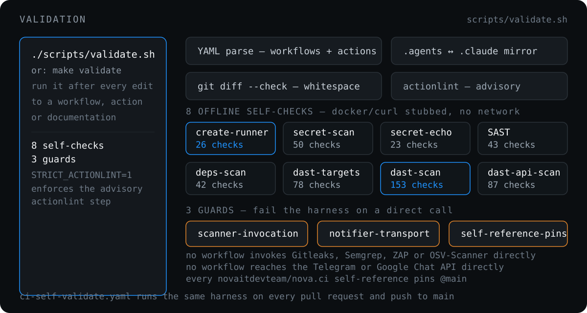

# Validation

<p align="center">
  
</p>

One harness runs every check:

```bash
./scripts/validate.sh   # or: make validate
```

[`scripts/validate.sh`](../scripts/validate.sh) runs a YAML parser over all `.github/workflows/*.yaml` and `.github/actions/*/action.yml`, `git diff --check` for whitespace, an `.agents` ↔ `.claude` skill mirror sync check, three documentation-asset checks (every page under `docs/` opens with a diagram, every referenced asset resolves, no asset drops below `font-size` 18), the [`ci-build-create-runner.sh`](../.github/workflows/ci-build-create-runner.sh), Gitleaks, Semgrep and DAST [`scan.sh`](../.github/actions/gitleaks/scan.sh) self-checks, guards that no workflow reaches the Telegram or Google Chat API directly or invokes a scanner itself, and `actionlint` when available — **advisory** by default, because the repo carries a pre-existing backlog of shellcheck-info and expression findings. Set `STRICT_ACTIONLINT=1` to enforce once that backlog is cleared.

## Runner script self-check

[`scripts/test-create-runner.sh`](../scripts/test-create-runner.sh) runs `ci-build-create-runner.sh` offline against 22 scenarios: a `curl` shim on `PATH` answers the Hetzner and GitHub calls from canned JSON, `sleep` is stubbed out, and each scenario asserts the emitted `$GITHUB_OUTPUT`. It touches no network, no credentials and no Hetzner project, and covers reuse, ghost registrations, both caps, the sizing matrix (including the `base_ref`-scoped DAST branch and a missing or unreadable event payload), and all four create-lock outcomes (free, held, stale, API failure).

Run it alone against any copy of the script:

```bash
./scripts/test-create-runner.sh [path-to-script]
```

## Secret scan self-check

[`scripts/test-secret-scan.sh`](../scripts/test-secret-scan.sh) gives
[`scan.sh`](../.github/actions/gitleaks/scan.sh) the same treatment, for the same
reason: it decides whether a pull request may merge. It builds throwaway git repos and
runs the real, pinned Gitleaks binary over them — 24 assertions covering clean and
dirty pull requests, follow-up deletion versus branch rewrite, both allowlist
mechanisms, merge-base scoping, push ranges, a legacy finding outside the range, new
branches and rewritten history, that findings stay redacted in both stdout and the
summary, and four fail-closed cases.

The version and checksum come out of
[`action.yml`](../.github/actions/gitleaks/action.yml), so the harness can never test a
version CI does not run. Fixture credentials are assembled from halves at runtime, so
no line of the harness itself trips the scanner. It uses `gitleaks` from `PATH` when
present (`brew install gitleaks`), otherwise downloads the pinned linux_x64 build.

```bash
./scripts/test-secret-scan.sh
```

## SAST and DAST scan self-checks

The two [SAST and DAST](sast-dast.md) actions get the same treatment, for the reason
that page is built around: the difference between "found nothing" and "never ran" is
invisible in the tools' own output, so it has to be asserted.

[`scripts/test-sast-scan.sh`](../scripts/test-sast-scan.sh) runs the Semgrep
[`scan.sh`](../.github/actions/semgrep/scan.sh) against 13 scenarios with `docker`
stubbed by a shim on `PATH`, so it needs no image and no network. It covers a clean
run, findings at the counted severity, and every fail-closed case the canary guard
exists for: no output file, a non-zero exit, unparseable JSON, zero files scanned, and
a result set in which the canary rule did not fire. It also asserts the canary is never
counted as a finding — including when the counted severity is set to the canary's own
`INFO`.

[`scripts/test-dast-scan.sh`](../scripts/test-dast-scan.sh) does the same for the ZAP
[`scan.sh`](../.github/actions/dast/scan.sh) across 13 scenarios, with `docker` and
`curl` stubbed. It asserts the four outcomes stay distinct — `clean`, `findings`,
`not-run` and `error` — plus the boot wait loop, teardown on every path, and that a
no-database run never starts postgres or redis.

```bash
./scripts/test-sast-scan.sh
./scripts/test-dast-scan.sh
```

## Scanner invocation guard

`validate.sh` fails when a workflow invokes **Gitleaks, Semgrep or ZAP directly** — a
`gitleaks git` line, a `semgrep scan`/`semgrep ci` line, a `docker run` of a Semgrep
image, `zap-baseline.py` or `zap-full-scan.py`, or a third-party action for any of the
three. Each tool's pin, its guard logic and its harness live in its composite action,
and one inline step bypasses all three at once. Commented-out lines and references to a
step's own `id`/outputs are not invocations and do not trip it.

> [!NOTE]
> **The ZAP half is narrower than the other two**: it matches the two ZAP scripts and a
> third-party `zaproxy` action, but **not** a bare `docker run ghcr.io/zaproxy/zaproxy`,
> which the Semgrep pattern does catch for its own images. All three are per-line greps,
> so none of them catches an invocation split across a line-broken YAML block scalar.
> They stop careless copy-paste, not a determined bypass.

[`ci-self-validate.yaml`](../.github/workflows/ci-self-validate.yaml) runs the same harness (with `actionlint` installed) on every pull request and push to `main`.

After changing CI behavior, still verify by hand that these docs, [`CLAUDE.md`](../CLAUDE.md), [`AGENTS.md`](../AGENTS.md) and [`.agents/skills/nova-ci/SKILL.md`](../.agents/skills/nova-ci/SKILL.md) (with its `.claude/` mirror) describe the same routing.

---

[← Notifications](notifications.md) · [Docs index](README.md) · [Reference →](reference.md)
